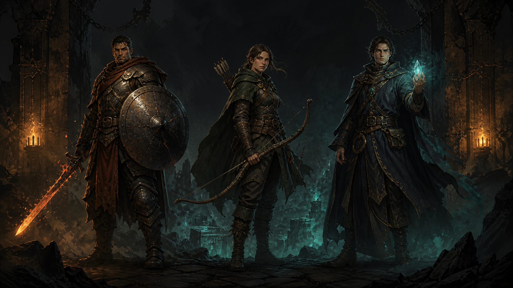

# Cinderwake

[Play the public build](https://alexeygrigorev.github.io/game-tester/) · [Open the public quality report](https://alexeygrigorev.github.io/game-tester/quality/)

Cinderwake is an original browser action RPG and, more importantly, a reference framework for testing games from arbitrary state. A test can load a complete JSON world, apply semantic input at exact 60 Hz ticks, then retain three synchronized forms of evidence:

1. a canonical state snapshot and hash proving what the game did;
2. a semantic render manifest explaining every actor's clip, frame, anchors, bounds, layer, and camera transform;
3. PNG frames and contact sheets showing whether the result actually looks natural over time.



## Play

```bash
npm ci
npm run dev
```

Choose Vanguard, Ranger, or Arcanist, enter a repeatable seed, clear the generated ruin, collect deterministic drops, and enter the opened rift. Use WASD or arrow keys to move, the pointer to aim, left click to strike, right click for the class ability, and Q to drink a tonic. The interface also works with touch action buttons.

This project takes inspiration from the readable top-down combat loop of classic action RPGs, but its world, characters, enemies, art, names, and implementation are original.

## Test any state

Open the browser with `?testMode=1`; the deliberately narrow `window.__GAME_TEST__` bridge is then available. It accepts a built-in scenario name, a `ScenarioV1` object, or its JSON string.

```ts
window.__GAME_TEST__.loadScenario(myScenario);
window.__GAME_TEST__.queueInputs([
  { tick: 120, input: { moveX: 1 } },
  { tick: 132, input: { attack: true } },
  { tick: 133, input: { attack: false } },
]);

const stateAtImpact = window.__GAME_TEST__.step(20, { render: true });
const stateHash = window.__GAME_TEST__.stateHash();
const geometry = window.__GAME_TEST__.renderManifest();
const png = window.__GAME_TEST__.captureFrame();
```

The scenario schema can inject the tick and phase; player and enemy transforms, velocities, health, cooldowns, and animation locks; active attacks, projectiles, loot, and effects; RNG stream states; metrics; exit state; and event history. Loading validates and constructs a fresh world instead of patching a running one, so old timers, inputs, and entities cannot leak into the next test. See [scenario authoring](docs/scenario-authoring.md) and the [complete fixture](public/scenarios/arbitrary-state.json).

## Quality workflow

```text
ScenarioV1 + exact input tape
            │
            ▼
 deterministic 60 Hz simulation
       ┌────┼────────────┐
       ▼    ▼            ▼
   state   render       PNG sequence
   hash    manifest     + contact sheet
       │    │            │
       └────┼────────────┘
            ▼
 invariants + pixel baselines + visual review
```

Run every source-level gate:

```bash
npm run check
```

Run the real Chromium input and visual suite:

```bash
npx playwright install chromium
npm run test:e2e
```

Generate a self-contained sequence report and machine-readable assessment:

```bash
npm run capture:sequence -- --scenario animation-walk --frames 16 --step 2
npm run capture:sequence -- --scenario combat-loot --action attack --frames 16 --step 2
```

Each run writes exact frames, close-ups, state history, render-manifest history, metadata, a contact sheet, an HTML report, and `animation-analysis.json` under `test-results/sequences/<scenario>/`. The assessor rejects anchor jitter, position/velocity disagreement, uneven speed, frame skips, one-shot backward frame jumps, changing proportions, and clipping. Screenshot baselines are updated only after reviewing the changed frame sequence:

```bash
npm run test:visual:update
npm run test:visual
```

## Source quality standards

- Authored TypeScript, JavaScript, CSS, HTML, JSON, and Markdown stay formatted and human-readable.
- The production Vite build explicitly disables JavaScript and CSS minification and emits source maps, so the published artifact is inspectable too.
- Strict TypeScript, ESLint, Prettier, unit tests, browser tests, and visual tests run in CI.
- Simulation code never reads wall-clock time or `Math.random()`; random domains use named seeded streams.
- Rendering cannot mutate gameplay state, and browser events become semantic input before simulation consumes them.
- A changed tolerance, schema, baseline, or animation rule must be documented and committed as a focused decision.

## Documentation

- [Game design and rules](docs/game-design.md)
- [Testing architecture](docs/testing-architecture.md)
- [Animation quality model and thresholds](docs/quality-model.md)
- [Scenario authoring guide](docs/scenario-authoring.md)
- [Chronological development decisions](docs/development-log.md)
- [Architecture decision records](docs/decisions/)

CI publishes the tested game and its latest Playwright and temporal frame-sequence reports together on GitHub Pages. Every artifact therefore points back to the same commit and can be reproduced with the command recorded in its metadata.
